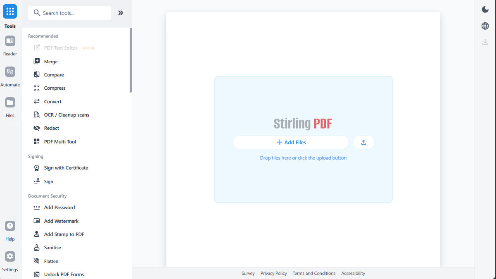

<p align="center">
  
</p>

<h1 align="center">RyanPDF - The Open-Source PDF Platform</h1>

RyanPDF is a powerful, open-source PDF editing platform. Run it as a personal desktop app, in the browser, or deploy it on your own servers with a private API. Edit, sign, redact, convert, and automate PDFs without sending documents to external services.



## Key Capabilities

- **Everywhere you work** - Desktop client, browser UI, and self-hosted server with a private API.
- **50+ PDF tools** - Edit, merge, split, sign, redact, convert, OCR, compress, and more.
- **Automation & workflows** - No-code pipelines direct in UI with APIs to process millions of PDFs.
- **Enterprise‑grade** - SSO, auditing, and flexible on‑prem deployments.
- **Developer platform** - REST APIs available for nearly all tools to integrate into your existing systems.
- **Global UI** - Interface available in English and Vietnamese, with a language switcher built in.

For a full feature list, see the [Developer Guide](DeveloperGuide.md).

## Quick Start

```bash
task docker:build
task docker:up
```

Then open: http://localhost:8080

For full installation options (including desktop and Kubernetes), see our [Developer Guide](DeveloperGuide.md).

## Resources

- [**Developer Guide**](DeveloperGuide.md)
- [**Contributing**](CONTRIBUTING.md)

## Support

- **Bug Reports**: [GitHub Issues](https://github.com/luckyhoang1988/workPDF_Ryan/issues)

## Contributing

We welcome contributions! Please see [CONTRIBUTING.md](CONTRIBUTING.md) for guidelines.

This project uses [Task](https://taskfile.dev/) as a unified command runner for all build, dev, and test commands. Run `task dev` to get started running the editor, run `task` to see the most common commands, or see the [Developer Guide](DeveloperGuide.md) for full details.

For adding translations, see the [Translation Guide](devGuide/HowToAddNewLanguage.md).

## License

RyanPDF is fully open source under the [MIT License](LICENSE).
